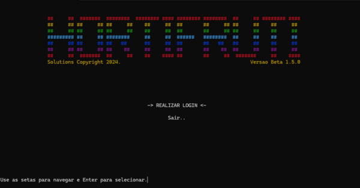
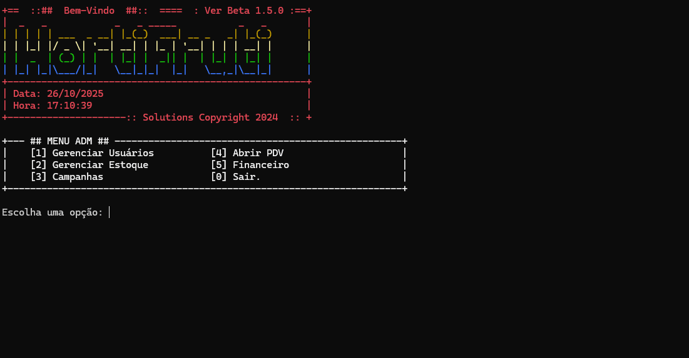
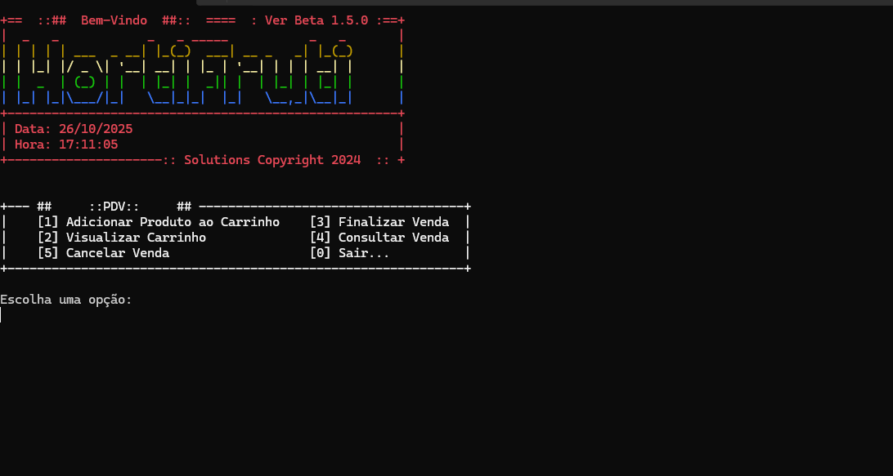

# Sistema de ERP para Hortifruti em Linguagem C


Este repositório contém o código-fonte de um **sistema de gestão empresarial (ERP)** completo para um hortifruti de pequeno porte, desenvolvido inteiramente em **linguagem C**. O sistema oferece funcionalidades de controle de estoque, ponto de venda (PDV), gestão financeira, cadastro de usuários e integração com balança analógica.

## 📋 Índice

- [Visão Geral](#-visão-geral)
- [Arquitetura do Sistema](#-arquitetura-do-sistema)
- [Estrutura Modular](#-estrutura-modular)
- [Módulos do Sistema](#-módulos-do-sistema)
- [Funcionalidades](#-funcionalidades)
- [Telas do Sistema](#-telas-do-sistema)
- [Compilação e Execução](#-compilação-e-execução)
- [Credenciais de Acesso](#-credenciais-de-acesso)
- [Banco de Dados](#-banco-de-dados)
- [Dependências](#-dependências)

## 🎯 Visão Geral

O **Sistema ERP Hortifruti** foi desenvolvido para atender às necessidades de pequenos estabelecimentos comerciais do setor de hortifruti, oferecendo uma solução completa e integrada para gerenciamento de vendas, estoque, finanças e operações diárias. O sistema é dividido em dois executáveis principais que trabalham de forma integrada através de um banco de dados compartilhado em arquivos binários.

### Características Principais

- **Interface em modo texto (Console)** utilizando a biblioteca PDCurses
- **Banco de dados em arquivos binários** (.dat e .idx)
- **Arquitetura modular** com separação clara de responsabilidades
- **Dois módulos independentes** mas integrados
- **Sistema de autenticação** com controle de acesso
- **Geração de códigos de barras** através da biblioteca Zint
- **Relatórios financeiros** e de vendas
- **Scripts de build** para Windows e Linux/macOS
- **Makefile** para compilação automatizada

## 🏗️ Arquitetura do Sistema

O sistema foi construído utilizando a linguagem C e a biblioteca **PDCurses** para a criação da interface de usuário em modo texto no console. A persistência dos dados é realizada através de arquivos binários com as extensões `.dat` para os dados e `.idx` para os índices, simulando um sistema de banco de dados relacional.

### Fluxo de Operação

```
┌─────────────────┐         ┌──────────────────┐
│   balanca.exe   │───────▶  Arquivos .dat      ◀────────┐
│  (Sem login)    │         │   e .idx         │          │
└─────────────────┘         │  (Banco de       │          │
                            │   Dados)         │          │
                            └──────────────────┘          │
                                     ▲                    │
                                     │                    │
                            ┌────────┴────────┐           │
                            │                 │           │
                     ┌──────┴──────┐   ┌──────┴──────┐    │
                     │    PDV      │   │    ADMIN    │    │
                     │ (admin/     │   │ (admin/     │    │
                     │  admin)     │   │  admin)     │    │
                     └─────────────┘   └─────────────┘    │
                            │                 │           │
                            └────────┬────────┘           │
                                     │                    │
                            ┌────────▼────────┐           │
                            │ PimModulos.exe  │───────────┘
                            │   (Login)       │
                            └─────────────────┘
```

## 📂 Estrutura Modular

O projeto foi organizado de forma modular para facilitar a manutenção, escalabilidade e colaboração:

```
hortifruti/
│
├── src/                      # Código-fonte (.c)
│   ├── core/                 # Núcleo do sistema
│   │   ├── main.c           # Ponto de entrada
│   │   ├── login.c          # Autenticação
│   │   └── link.c           # Funções auxiliares
│   │
│   ├── modules/              # Módulos de negócio
│   │   ├── produto.c        # Produtos
│   │   ├── vendas.c         # Vendas
│   │   ├── carrinho.c       # Carrinho
│   │   ├── cliente.c        # Clientes
│   │   ├── funcionario.c    # Funcionários
│   │   ├── fornecedor.c     # Fornecedores
│   │   ├── financeiro.c     # Financeiro
│   │   ├── contas.c         # Contas
│   │   └── pdv.c            # PDV
│   │
│   └── balanca.c            # Balança
│
├── include/                  # Headers (.h)
│   ├── core/                # Headers do núcleo
│   ├── modules/             # Headers dos módulos
│   └── balanca.h            # Header da balança
│
├── build/                    # Arquivos compilados
├── data/                     # Banco de dados
├── docs/                     # Documentação
│   ├── images/              # Imagens das telas
│   └── ESTRUTURA.md         # Documentação da estrutura
│
├── scripts/                  # Scripts de build
│   ├── build.sh             # Linux/macOS
│   └── build.bat            # Windows
│
├── Makefile                  # Build automatizado
├── PimModulos.pro           # Projeto Qt Creator
├── vcpkg.json               # Dependências
└── README.md                # Este arquivo
```

Para mais detalhes sobre a estrutura, consulte [docs/ESTRUTURA.md](docs/ESTRUTURA.md).

## 🔧 Módulos do Sistema

O sistema é organizado de forma modular, facilitando a manutenção e evolução do código.

### 1. Módulo de Autenticação (login.c / login.h)

Responsável pelo controle de acesso ao sistema.

**Funcionalidades:**
- Sistema de login com usuário e senha
- Interface colorida com PDCurses
- Validação de credenciais
- Redirecionamento para PDV ou ADMIN

**Usuários padrão:**
```c
UsuarioLogin usuarios[] = {
    {"admin", "admin", 1},
    {"pdv", "pdv", 2}
};
```

### 2. Módulo de Produtos (produto.c / produto.h)

Gerenciamento completo do catálogo de produtos.

**Estrutura de dados:**
```c
typedef struct {
    int id;
    char nome[MAX];
    int quantidade;
    double precoCusto;
    double precoVenda;
    char tipo[MAX];
    char descricao[MAX];
    bool vendidoAGranela;
    double precoPorKilo;
    char codigoBarras[MAX_CODIGO_BARRAS];
    DataValidade validade;
} Produto;
```

**Funcionalidades:**
- Cadastro de produtos
- Atualização de estoque
- Busca por ID ou nome
- Validação de data de validade
- Suporte a produtos vendidos a granel

### 3. Módulo de Vendas (vendas.c / vendas.h)

Controle de todas as operações de venda.

**Funcionalidades:**
- Registro de vendas
- Histórico de transações
- Consulta de vendas por ID
- Cancelamento de vendas
- Integração com estoque

### 4. Módulo de Carrinho (carrinho.c / carrinho.h)

Sistema de carrinho de compras para o PDV.

**Funcionalidades:**
- Adicionar produtos ao carrinho
- Remover produtos do carrinho
- Visualizar itens no carrinho
- Calcular total da compra
- Limpar carrinho após finalização

### 5. Módulo de Usuários

#### Cliente (cliente.c / cliente.h)
- Cadastro de clientes
- Histórico de compras
- Dados de contato

#### Funcionário (funcionario.c / funcionario.h)
- Cadastro de funcionários
- Controle de acesso
- Dados pessoais e profissionais

#### Fornecedor (fornecedor.c / fornecedor.h)
- Cadastro de fornecedores
- Dados de contato
- Histórico de compras

### 6. Módulo Financeiro (financeiro.c / financeiro.h)

Gestão financeira completa do estabelecimento.

**Funcionalidades:**
- Controle de fluxo de caixa
- Registro de despesas
- Relatórios de lucro/perda
- Gráficos financeiros

### 7. Módulo de Contas (contas.c / contas.h)

Gerenciamento de contas a pagar e receber.

**Funcionalidades:**
- Contas a pagar para fornecedores
- Contas a receber de clientes
- Controle de vencimentos
- Histórico de pagamentos

### 8. Módulo de PDV (pdv.c / pdv.h)

Interface do ponto de venda.

**Funcionalidades:**
- Interface otimizada para vendas rápidas
- Busca de produtos por nome ou ID
- Integração com carrinho
- Finalização de vendas
- Consulta de vendas anteriores

### 9. Módulo de Balança (balanca.c / balanca.h)

Sistema independente para pesagem de produtos.

**Funcionalidades:**
- Consulta de produtos por ID
- Registro de peso
- Geração de recibo em arquivo
- Validação de estoque disponível
- Não requer autenticação

### 10. Módulo Principal (main.c / main.h)

Ponto de entrada do sistema PimModulos.

**Funcionalidades:**
- Menu administrativo
- Coordenação entre módulos
- Inicialização do sistema
- Gerenciamento de sessão

### 11. Módulo de Link (link.c / link.h)

Funções auxiliares e utilitárias compartilhadas entre módulos.

**Funcionalidades:**
- Funções de entrada/saída
- Validações comuns
- Formatação de dados
- Utilitários gerais

## ⚡ Funcionalidades

### Módulo Administrativo

| Funcionalidade | Descrição |
|----------------|-----------|
| **Gerenciar Usuários** | Cadastro, edição e remoção de funcionários, clientes e fornecedores |
| **Gerenciar Estoque** | Controle completo de produtos, incluindo cadastro, atualização de quantidades e preços |
| **Campanhas** | Criação e gestão de promoções e campanhas de marketing |
| **Financeiro** | Módulo completo de gestão financeira com despesas, receitas e fluxo de caixa |
| **Contas a Pagar/Receber** | Controle de contas a pagar para fornecedores e contas a receber de clientes |
| **Relatórios** | Geração de relatórios de caixa, lucros/perdas, despesas e gráficos |

### Módulo PDV (Ponto de Venda)

| Funcionalidade | Descrição |
|----------------|-----------|
| **Adicionar Produto ao Carrinho** | Busca por nome ou ID e adição ao carrinho de compras |
| **Visualizar Carrinho** | Exibição dos produtos no carrinho com valores e quantidades |
| **Finalizar Venda** | Processamento da venda e atualização do estoque |
| **Consultar Venda** | Busca de vendas anteriores por ID ou data |
| **Cancelar Venda** | Cancelamento de vendas em andamento |

### Módulo Balança

| Funcionalidade | Descrição |
|----------------|-----------|
| **Buscar Produto por ID** | Consulta de produtos no banco de dados |
| **Registrar Peso** | Entrada do peso do produto em quilogramas |
| **Gerar Recibo** | Criação de ticket com informações do produto, peso e valor total |
| **Verificar Estoque** | Validação da disponibilidade do produto antes da pesagem |

## 🖼️ Telas do Sistema

### Tela da Balança

Esta tela pertence ao `balanca.exe` e é utilizada para pesar os produtos. O operador digita o ID do produto, o sistema o localiza no banco de dados e, em seguida, o peso é inserido para gerar um recibo.


**Operações disponíveis:**
- `[A]` - Digite o ID do produto
- `[S]` - Sair

### Tela de Login

A tela de login é a porta de entrada para os módulos de PDV e ADMIN do `PimModulos.exe`. Utiliza a biblioteca PDCurses para criar uma interface colorida e interativa.



**Navegação:**
- Use as setas para navegar entre as opções
- Enter para selecionar

### Menu Administrativo (ADMIN)

Após o login como administrador, o usuário tem acesso ao menu principal do painel administrativo, onde pode gerenciar as diversas áreas do sistema.



**Opções do menu:**
- `[1]` - Gerenciar Usuários
- `[2]` - Gerenciar Estoque
- `[3]` - Campanhas
- `[4]` - Abrir PDV
- `[5]` - Financeiro
- `[0]` - Sair

### Ponto de Venda (PDV)

Esta é a tela principal do Ponto de Venda, onde o operador pode adicionar produtos ao carrinho, visualizar o carrinho, finalizar a venda, consultar vendas anteriores e cancelar uma venda em andamento.



**Operações disponíveis:**
- `[1]` - Adicionar Produto ao Carrinho
- `[2]` - Visualizar Carrinho
- `[3]` - Finalizar Venda
- `[4]` - Consultar Venda
- `[5]` - Cancelar Venda
- `[0]` - Sair

## 🔧 Compilação e Execução

### Pré-requisitos

Para compilar o projeto, você precisa ter instalado:

- **Compilador C**: GCC (Linux/macOS) ou MinGW (Windows)
- **Make** (opcional, para usar o Makefile)
- **Qt Creator** (opcional, para facilitar a compilação)
- **vcpkg** (gerenciador de pacotes C/C++)

### Dependências

As seguintes bibliotecas são necessárias:

| Biblioteca | Versão | Descrição |
|------------|--------|-----------|
| **pdcurses** | Última | Biblioteca para interface de texto em console |
| **zint** | Última | Geração de códigos de barras |
| **fmt** | Última | Formatação de strings |

### Instalação das Dependências com vcpkg

```bash
# Instalar vcpkg (se ainda não tiver)
git clone https://github.com/Microsoft/vcpkg.git
cd vcpkg
./bootstrap-vcpkg.sh  # Linux/macOS
# ou
bootstrap-vcpkg.bat   # Windows

# Instalar as dependências
./vcpkg install pdcurses zint fmt
```

### Compilação com Makefile

```bash
# Compilar todos os executáveis
make

# Compilar e executar PimModulos
make run-pim

# Compilar e executar Balança
make run-balanca

# Limpar arquivos compilados
make clean

# Ver ajuda
make help
```

### Compilação com Scripts

#### Linux/macOS

```bash
chmod +x scripts/build.sh
./scripts/build.sh
```

#### Windows

```cmd
scripts\build.bat
```

### Compilação Manual

#### Linux/macOS

```bash
# Criar diretórios
mkdir -p build/core build/modules data

# Compilar PimModulos
gcc -Wall -Wextra -Iinclude -Iinclude/core -Iinclude/modules \
    src/core/main.c src/core/login.c src/core/link.c \
    src/modules/produto.c src/modules/vendas.c src/modules/carrinho.c \
    src/modules/cliente.c src/modules/funcionario.c src/modules/fornecedor.c \
    src/modules/financeiro.c src/modules/contas.c src/modules/pdv.c \
    -o PimModulos -lpdcurses -lzint -lfmt

# Compilar Balança
gcc -Wall -Wextra -Iinclude -Iinclude/core -Iinclude/modules \
    src/balanca.c src/modules/produto.c src/core/link.c \
    -o balanca -lpdcurses
```

#### Windows (MinGW)

```cmd
gcc -Wall -Wextra -Iinclude -Iinclude\core -Iinclude\modules ^
    src\core\main.c src\core\login.c src\core\link.c ^
    src\modules\produto.c src\modules\vendas.c src\modules\carrinho.c ^
    src\modules\cliente.c src\modules\funcionario.c src\modules\fornecedor.c ^
    src\modules\financeiro.c src\modules\contas.c src\modules\pdv.c ^
    -o PimModulos.exe -lpdcurses -lzint -lfmt

gcc -Wall -Wextra -Iinclude -Iinclude\core -Iinclude\modules ^
    src\balanca.c src\modules\produto.c src\core\link.c ^
    -o balanca.exe -lpdcurses
```

### Compilação com Qt Creator

1. Abra o arquivo `PimModulos.pro` no Qt Creator
2. Configure o kit de compilação (MinGW ou GCC)
3. Ajuste os caminhos de include no arquivo `.pro` se necessário
4. Clique em "Build" → "Build Project"
5. Os executáveis serão gerados na pasta `build/`

### Execução

#### Windows

```bash
# Executar o módulo principal
PimModulos.exe

# Executar a balança (em outro terminal)
balanca.exe
```

#### Linux/macOS

```bash
# Executar o módulo principal
./PimModulos

# Executar a balança (em outro terminal)
./balanca
```

## 🔐 Credenciais de Acesso

### PimModulos.exe

| Módulo | Usuário | Senha | Descrição |
|--------|---------|-------|-----------|
| **PDV** | `admin` | `admin` | Acesso ao ponto de venda |
| **ADMIN** | `admin` | `admin` | Acesso ao painel administrativo |

### balanca.exe

**Não requer autenticação** - Acesso livre para operações de pesagem.

## 💾 Banco de Dados

O sistema utiliza um método de armazenamento de dados baseado em **arquivos binários**. Cada tipo de dado é armazenado em um arquivo `.dat`, e para otimizar as buscas, são utilizados arquivos de índice `.idx`.

### Arquivos de Dados

Todos os arquivos de dados são armazenados no diretório `data/`:

| Arquivo | Descrição |
|---------|-----------|
| `produto.dat` | Dados dos produtos cadastrados |
| `produto.idx` | Índice de produtos para busca rápida |
| `usuarios.dat` | Dados dos usuários do sistema |
| `usuarios.idx` | Índice de usuários |
| `vendas.dat` | Registro de todas as vendas |
| `clientes.dat` | Cadastro de clientes |
| `fornecedores.dat` | Cadastro de fornecedores |
| `fornecedores.idx` | Índice de fornecedores |
| `fluxo_caixa.dat` | Registro de movimentações financeiras |
| `contas_pagar.dat` | Contas a pagar |
| `despesas.dat` | Registro de despesas |

### Estrutura de Dados - Produto

```c
typedef struct {
    int id;                                // Identificador único
    char nome[MAX];                        // Nome do produto
    int quantidade;                        // Quantidade em estoque
    double precoCusto;                     // Preço de custo
    double precoVenda;                     // Preço de venda
    char tipo[MAX];                        // Tipo/categoria
    char descricao[MAX];                   // Descrição detalhada
    bool vendidoAGranela;                  // Vendido a granel?
    double precoPorKilo;                   // Preço por kg (se granel)
    char codigoBarras[MAX_CODIGO_BARRAS];  // Código de barras
    DataValidade validade;                 // Data de validade
} Produto;
```

## 📦 Dependências

O arquivo `vcpkg.json` contém a configuração das dependências do projeto:

```json
{
  "$schema": "https://raw.githubusercontent.com/microsoft/vcpkg-tool/main/docs/vcpkg.schema.json",
  "name": "mypackage",
  "version-string": "0.0.1",
  "dependencies": [
    "fmt",
    "pdcurses",
    "zint"
  ]
}
```

---

**Desenvolvido por ttror - Copyright 2024**

**Versão:** Beta 1.5.0

