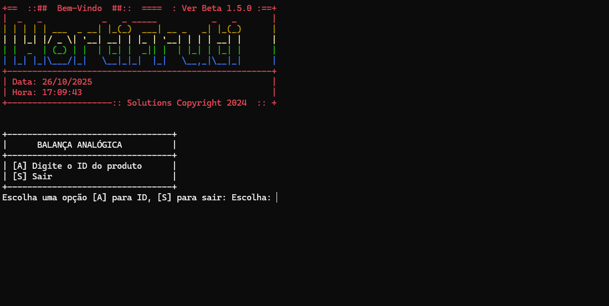
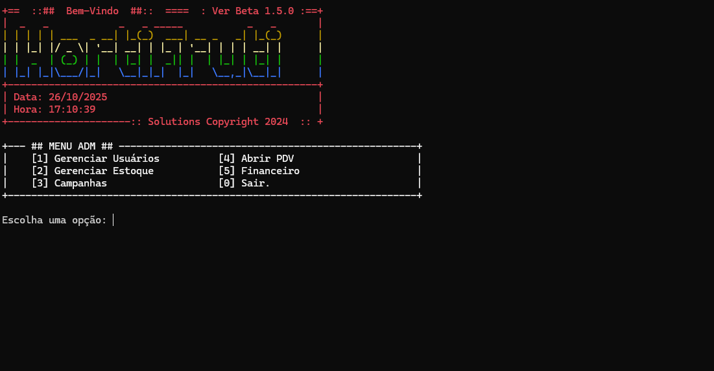

# Sistema de ERP para Hortifruti em Linguagem C


Este repositório contém o código-fonte de um **sistema de gestão empresarial (ERP)** completo para um hortifruti de pequeno porte, desenvolvido inteiramente em **linguagem C**. O sistema oferece funcionalidades de controle de estoque, ponto de venda (PDV), gestão financeira, cadastro de usuários e integração com balança analógica.

## 📋 Índice

- [Visão Geral](#-visão-geral)
- [Arquitetura do Sistema](#-arquitetura-do-sistema)
- [Funcionalidades](#-funcionalidades)
- [Telas do Sistema](#-telas-do-sistema)
- [Estrutura de Arquivos](#-estrutura-de-arquivos)
- [Compilação e Execução](#-compilação-e-execução)
- [Credenciais de Acesso](#-credenciais-de-acesso)
- [Banco de Dados](#-banco-de-dados)
- [Dependências](#-dependências)
- [Contribuindo](#-contribuindo)
- [Licença](#-licença)

## 🎯 Visão Geral

O **Sistema ERP Hortifruti** foi desenvolvido para atender às necessidades de pequenos estabelecimentos comerciais do setor de hortifruti, oferecendo uma solução completa e integrada para gerenciamento de vendas, estoque, finanças e operações diárias. O sistema é dividido em dois executáveis principais que trabalham de forma integrada através de um banco de dados compartilhado em arquivos binários.

### Características Principais

- **Interface em modo texto (Console)** utilizando a biblioteca PDCurses
- **Banco de dados em arquivos binários** (.dat e .idx)
- **Dois módulos independentes** mas integrados
- **Sistema de autenticação** com controle de acesso
- **Geração de códigos de barras** através da biblioteca Zint
- **Relatórios financeiros** e de vendas

## 🏗️ Arquitetura do Sistema

O sistema foi construído utilizando a linguagem C e a biblioteca **PDCurses** para a criação da interface de usuário em modo texto no console. A persistência dos dados é realizada através de arquivos binários com as extensões `.dat` para os dados e `.idx` para os índices, simulando um sistema de banco de dados relacional.

### Módulos Principais

#### 1. PimModulos.exe

O módulo principal do sistema, que engloba duas áreas de operação:

##### **Painel Administrativo (ADMIN)**
Permite o gerenciamento completo do sistema, incluindo:
- Gerenciamento de usuários (funcionários, clientes e fornecedores)
- Controle de estoque de produtos
- Gestão de campanhas promocionais
- Módulo financeiro completo
- Contas a pagar e receber
- Relatórios gerenciais

##### **Ponto de Venda (PDV)**
Interface otimizada para operações de venda:
- Adição de produtos ao carrinho (por nome ou ID)
- Visualização do carrinho de compras
- Finalização de vendas
- Consulta de vendas anteriores
- Cancelamento de vendas

#### 2. balanca.exe

Um executável independente que simula uma **balança analógica**. Este módulo:
- Consulta o banco de dados de produtos
- Permite a pesagem de produtos vendidos a granel
- Gera tickets (recibos) com peso e valor
- Não requer autenticação
- Integra-se ao sistema principal através dos arquivos de dados compartilhados

### Fluxo de Operação

```
┌─────────────────┐         ┌──────────────────┐
│   balanca.exe   │────────▶│  Arquivos .dat   │◀────────┐
│  (Sem login)    │         │   e .idx         │         │
└─────────────────┘         │  (Banco de       │         │
                            │   Dados)         │         │
                            └──────────────────┘         │
                                     ▲                   │
                                     │                   │
                            ┌────────┴────────┐          │
                            │                 │          │
                     ┌──────┴──────┐   ┌──────┴──────┐  │
                     │    PDV      │   │    ADMIN    │  │
                     │ (admin/     │   │ (admin/     │  │
                     │  admin)     │   │  admin)     │  │
                     └─────────────┘   └─────────────┘  │
                            │                 │          │
                            └────────┬────────┘          │
                                     │                   │
                            ┌────────▼────────┐          │
                            │ PimModulos.exe  │──────────┘
                            │   (Login)       │
                            └─────────────────┘
```

## ⚡ Funcionalidades

### Módulo Administrativo

| Funcionalidade | Descrição |
|----------------|-----------|
| **Gerenciar Usuários** | Cadastro, edição e remoção de funcionários, clientes e fornecedores |
| **Gerenciar Estoque** | Controle completo de produtos, incluindo cadastro, atualização de quantidades e preços |
| **Campanhas** | Criação e gestão de promoções e campanhas de marketing |
| **Financeiro** | Módulo completo de gestão financeira com despesas, receitas e fluxo de caixa |
| **Contas a Pagar/Receber** | Controle de contas a pagar para fornecedores e contas a receber de clientes |
| **Relatórios** | Geração de relatórios de caixa, lucros/perdas, despesas e gráficos |

### Módulo PDV (Ponto de Venda)

| Funcionalidade | Descrição |
|----------------|-----------|
| **Adicionar Produto ao Carrinho** | Busca por nome ou ID e adição ao carrinho de compras |
| **Visualizar Carrinho** | Exibição dos produtos no carrinho com valores e quantidades |
| **Finalizar Venda** | Processamento da venda e atualização do estoque |
| **Consultar Venda** | Busca de vendas anteriores por ID ou data |
| **Cancelar Venda** | Cancelamento de vendas em andamento |

### Módulo Balança

| Funcionalidade | Descrição |
|----------------|-----------|
| **Buscar Produto por ID** | Consulta de produtos no banco de dados |
| **Registrar Peso** | Entrada do peso do produto em quilogramas |
| **Gerar Recibo** | Criação de ticket com informações do produto, peso e valor total |
| **Verificar Estoque** | Validação da disponibilidade do produto antes da pesagem |

## 🖼️ Telas do Sistema

### Tela da Balança

Esta tela pertence ao `balanca.exe` e é utilizada para pesar os produtos. O operador digita o ID do produto, o sistema o localiza no banco de dados e, em seguida, o peso é inserido para gerar um recibo.



**Operações disponíveis:**
- `[A]` - Digite o ID do produto
- `[S]` - Sair

### Tela de Login

A tela de login é a porta de entrada para os módulos de PDV e ADMIN do `PimModulos.exe`. Utiliza a biblioteca PDCurses para criar uma interface colorida e interativa.


**Navegação:**
- Use as setas para navegar entre as opções
- Enter para selecionar

### Menu Administrativo

Após o login como administrador, o usuário tem acesso ao menu principal do painel administrativo, onde pode gerenciar as diversas áreas do sistema.



**Opções do menu:**
- `[1]` - Gerenciar Usuários
- `[2]` - Gerenciar Estoque
- `[3]` - Campanhas
- `[4]` - Abrir PDV
- `[5]` - Financeiro
- `[0]` - Sair

### Ponto de Venda (PDV)

Esta é a tela principal do Ponto de Venda, onde o operador pode adicionar produtos ao carrinho, visualizar o carrinho, finalizar a venda, consultar vendas anteriores e cancelar uma venda em andamento.


**Operações disponíveis:**
- `[1]` - Adicionar Produto ao Carrinho
- `[2]` - Visualizar Carrinho
- `[3]` - Finalizar Venda
- `[4]` - Consultar Venda
- `[5]` - Cancelar Venda
- `[0]` - Sair

## 📁 Estrutura de Arquivos

```
hortifruti/
│
├── balanca.c              # Código principal do módulo de balança
├── main.c                 # Ponto de entrada do PimModulos
├── main.h                 # Cabeçalho principal
│
├── login.c / login.h      # Sistema de autenticação
├── pdv.c                  # Módulo de ponto de venda
│
├── produto.c / produto.h  # Gerenciamento de produtos
├── vendas.c / vendas.h    # Gerenciamento de vendas
├── carrinho.c / carrinho.h # Sistema de carrinho de compras
│
├── cliente.c / cliente.h  # Cadastro de clientes
├── funcionario.c / funcionario.h # Cadastro de funcionários
├── fornecedor.c / fornecedor.h   # Cadastro de fornecedores
│
├── financeiro.c / financeiro.h   # Módulo financeiro
├── contas.c / contas.h           # Contas a pagar/receber
│
├── link.c / link.h        # Funções auxiliares de ligação
│
├── PimModulos.pro         # Arquivo de projeto Qt Creator
├── vcpkg.json             # Configuração de dependências
│
├── .gitignore             # Arquivos ignorados pelo Git
└── README.md              # Este arquivo
```

## 🔧 Compilação e Execução

### Pré-requisitos

Para compilar o projeto, você precisa ter instalado:

- **Compilador C**: GCC (Linux/macOS) ou MinGW (Windows)
- **Qt Creator** (opcional, para facilitar a compilação)
- **vcpkg** (gerenciador de pacotes C/C++)

### Dependências

As seguintes bibliotecas são necessárias:

| Biblioteca | Versão | Descrição |
|------------|--------|-----------|
| **pdcurses** | Última | Biblioteca para interface de texto em console |
| **zint** | Última | Geração de códigos de barras |
| **fmt** | Última | Formatação de strings |

### Instalação das Dependências com vcpkg

```bash
# Instalar vcpkg (se ainda não tiver)
git clone https://github.com/Microsoft/vcpkg.git
cd vcpkg
./bootstrap-vcpkg.sh  # Linux/macOS
# ou
bootstrap-vcpkg.bat   # Windows

# Instalar as dependências
./vcpkg install pdcurses zint fmt
```

### Compilação Manual

#### Linux/macOS

```bash
gcc -o PimModulos main.c login.c pdv.c produto.c vendas.c carrinho.c \
    cliente.c funcionario.c fornecedor.c financeiro.c contas.c link.c \
    -lpdcurses -lzint -lfmt

gcc -o balanca balanca.c produto.c link.c -lpdcurses
```

#### Windows (MinGW)

```bash
gcc -o PimModulos.exe main.c login.c pdv.c produto.c vendas.c carrinho.c \
    cliente.c funcionario.c fornecedor.c financeiro.c contas.c link.c \
    -lpdcurses -lzint -lfmt

gcc -o balanca.exe balanca.c produto.c link.c -lpdcurses
```

### Compilação com Qt Creator

1. Abra o arquivo `PimModulos.pro` no Qt Creator
2. Configure o kit de compilação (MinGW ou GCC)
3. Clique em "Build" → "Build Project"
4. Os executáveis serão gerados na pasta `build/`

### Execução

#### Windows

```bash
# Executar o módulo principal
PimModulos.exe

# Executar a balança (em outro terminal)
balanca.exe
```

#### Linux/macOS

```bash
# Executar o módulo principal
./PimModulos

# Executar a balança (em outro terminal)
./balanca
```

## 🔐 Credenciais de Acesso

### PimModulos.exe

| Módulo | Usuário | Senha | Descrição |
|--------|---------|-------|-----------|
| **PDV** | `admin` | `admin` | Acesso ao ponto de venda |
| **ADMIN** | `admin` | `admin` | Acesso ao painel administrativo |

### balanca.exe

**Não requer autenticação** - Acesso livre para operações de pesagem.

## 💾 Banco de Dados

O sistema utiliza um método de armazenamento de dados baseado em **arquivos binários**. Cada tipo de dado é armazenado em um arquivo `.dat`, e para otimizar as buscas, são utilizados arquivos de índice `.idx`.

### Arquivos de Dados

| Arquivo | Descrição |
|---------|-----------|
| `produto.dat` | Dados dos produtos cadastrados |
| `produto.idx` | Índice de produtos para busca rápida |
| `usuarios.dat` | Dados dos usuários do sistema |
| `usuarios.idx` | Índice de usuários |
| `vendas.dat` | Registro de todas as vendas |
| `clientes.dat` | Cadastro de clientes |
| `fornecedores.dat` | Cadastro de fornecedores |
| `fornecedores.idx` | Índice de fornecedores |
| `fluxo_caixa.dat` | Registro de movimentações financeiras |
| `contas_pagar.dat` | Contas a pagar |
| `despesas.dat` | Registro de despesas |

### Estrutura de Dados - Produto

```c
typedef struct {
    int id;                                // Identificador único
    char nome[MAX];                        // Nome do produto
    int quantidade;                        // Quantidade em estoque
    double precoCusto;                     // Preço de custo
    double precoVenda;                     // Preço de venda
    char tipo[MAX];                        // Tipo/categoria
    char descricao[MAX];                   // Descrição detalhada
    bool vendidoAGranela;                  // Vendido a granel?
    double precoPorKilo;                   // Preço por kg (se granel)
    char codigoBarras[MAX_CODIGO_BARRAS];  // Código de barras
    DataValidade validade;                 // Data de validade
} Produto;
```

## 📦 Dependências

O arquivo `vcpkg.json` contém a configuração das dependências do projeto:

```json
{
  "$schema": "https://raw.githubusercontent.com/microsoft/vcpkg-tool/main/docs/vcpkg.schema.json",
  "name": "mypackage",
  "version-string": "0.0.1",
  "dependencies": [
    "fmt",
    "pdcurses",
    "zint"
  ]
}
```

## 🤝 Contribuindo

Contribuições são bem-vindas! Para contribuir com o projeto:

1. Faça um fork do repositório
2. Crie uma branch para sua feature (`git checkout -b feature/MinhaFeature`)
3. Commit suas mudanças (`git commit -m 'Adiciona MinhaFeature'`)
4. Push para a branch (`git push origin feature/MinhaFeature`)
5. Abra um Pull Request

### Diretrizes de Contribuição

- Mantenha o código limpo e bem documentado
- Siga o padrão de codificação existente
- Teste suas alterações antes de submeter
- Atualize a documentação quando necessário

## 📄 Licença

Este projeto está sob a licença MIT. Veja o arquivo `LICENSE` para mais detalhes.

---

**Desenvolvido por Solutions Copyright 2024**

**Versão:** Beta 1.5.0

Para dúvidas ou sugestões, abra uma issue no repositório.

